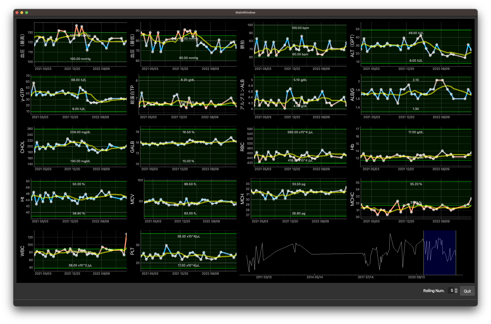

# これは何？

ラブラッドにて閲覧できる献血の記録をダウンロードして、可視化するツールです。

# 準備
## ラブラッドにログインするための.passwordファイルの作成

`get_blood_data.py`を実行するフォルダに`.password`ファイルを以下の内容で作成します。

```sh
BLOODCODE = 'xxxxxxxxxx'
PASSWORD = '**********'
RECORDPASSWORD = '****'
```

`get_blood_data.py`を実行すると、Chromeが立ち上がりデータの取得が行われます。
問題なければ、実行したフォルダに`blood_data.csv`




# 実行方法
1. 


